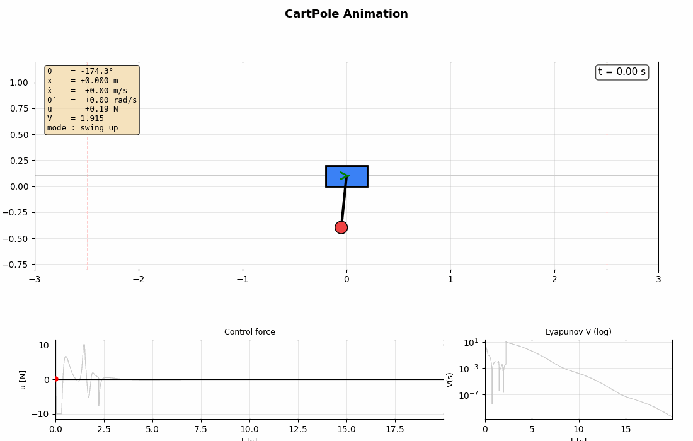
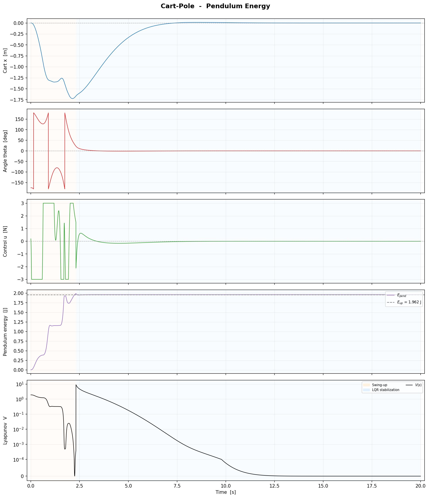
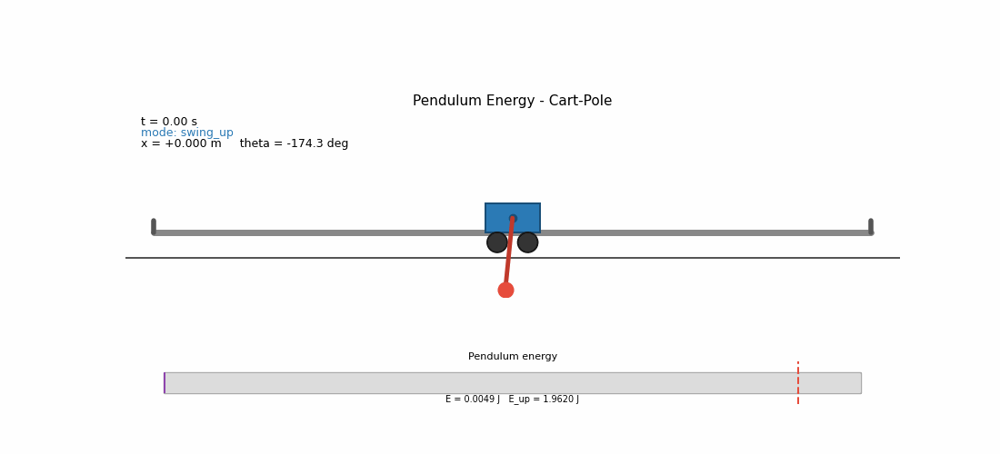
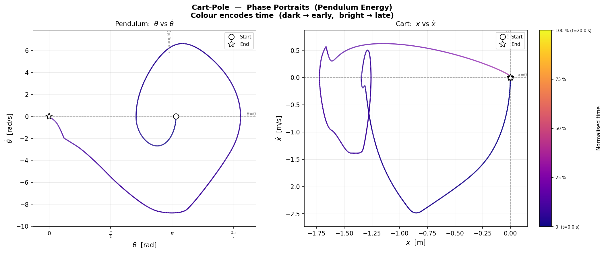
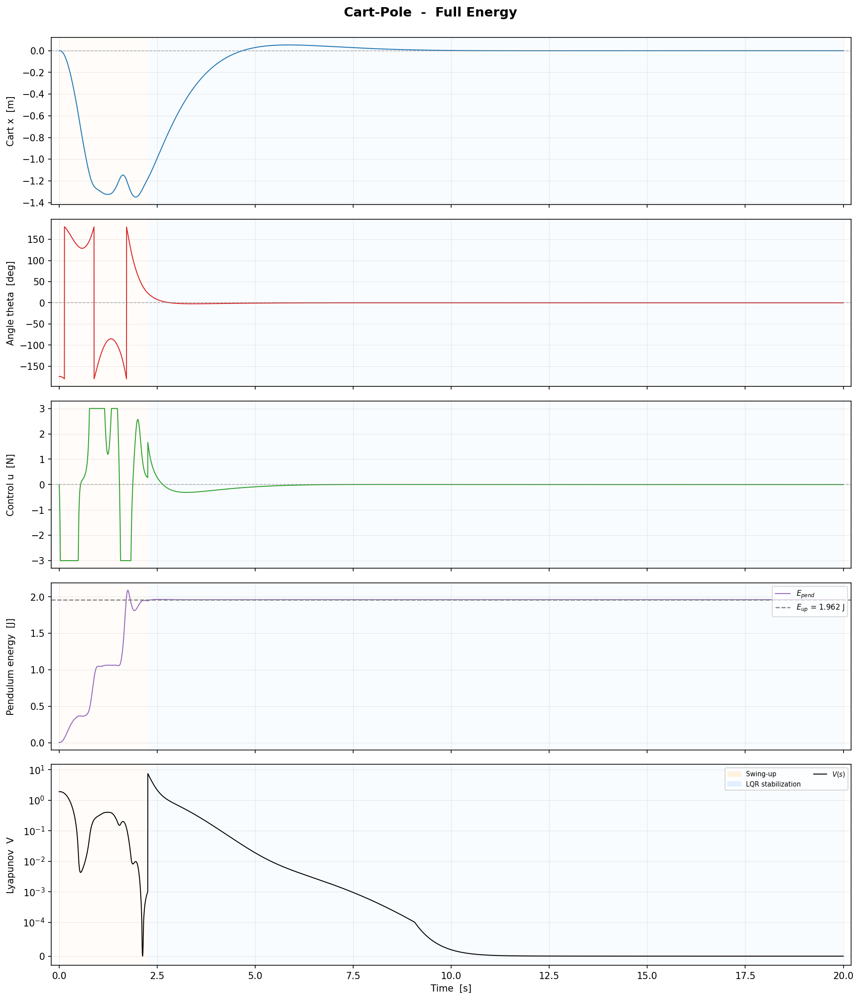
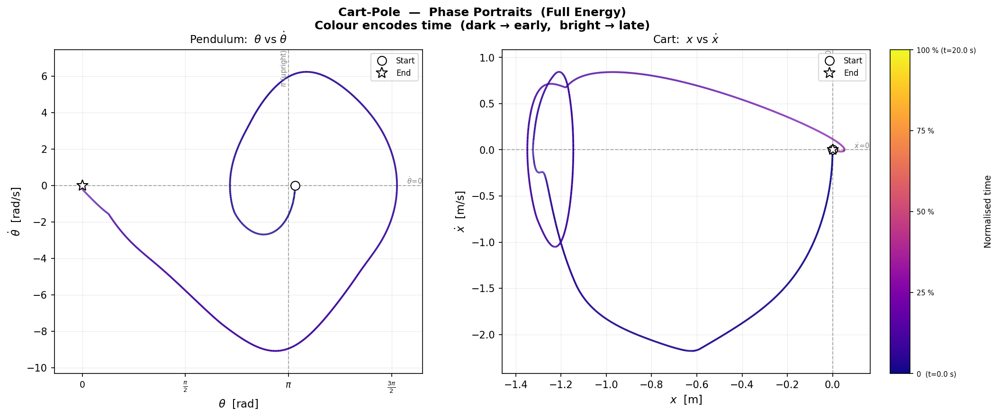
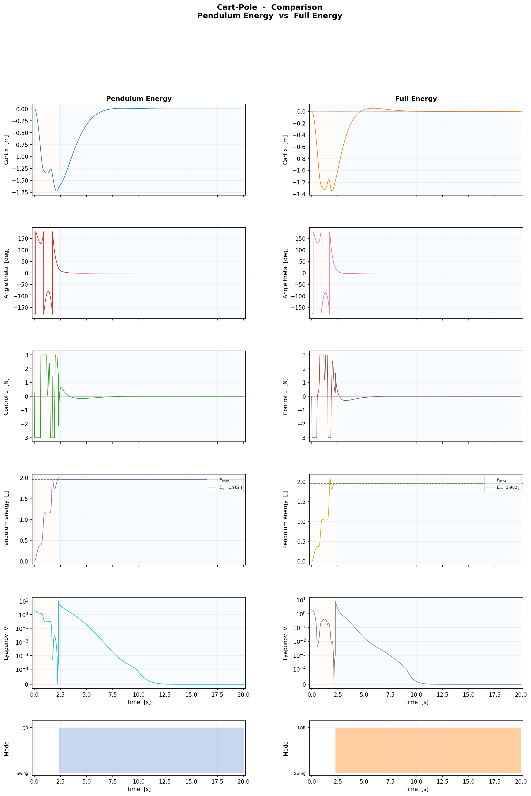

# Project CartPole - Lyapunov-based Control

*Energy-Based Swing-Up and LQR Stabilization*

This repository implements an energy-based controller for the Cart-Pole system, a classic underactuated robotic system. The project focuses on swinging the pendulum from the downward stable position to the upward unstable position using Lyapunov energy shaping, followed by a local LQR controller for precise asymptotic stabilization.

Project is about developing a control bounded system for an inverted pendulum (cartpole) based on Lyapunov functions.


## 📋 Brief description

The system consists of a cart and a pendulum attached to it. Control tasks:
1. **Swing-up**: Raise the pendulum from the downward (stable) position to the upward (unstable) position. (but it is not garanteed stability in an upper point)
2. **Stabilization**: Stabilize the pendulum in the upper unstable position (similarly)



**Run Project 1:**
```bash
cd Project_1_Lyapunov_based_control_cartpole/src
python main.py         
```
## 🔧 Architecture of Project
Project_1_Lyapunov_based_control_cartpole/  
├── src/    
│ ├── system.py # our cartpole model    
│ ├── controller.py # Lyapunov-based controller     
│ ├── simulation.py # data collection and simulation    
│ ├── visualization.py # visualization and animation   
│ └── main.py # initial start file   
├── configs/ # config files     
├── figures/ # graphics     
├── animations/ # video animation        
└── README.md       

## 1. System Description

| Symbol | Meaning |
|--------|---------|
| $x(t)$ | Cart position |
| $\theta(t)$ | Pendulum angle, **$\theta=0$ is upright** |
| $m_c$ | Cart mass |
| $m_p$ | Pendulum (point) mass |
| $l$ | Pendulum length (to center of mass) |
| $g$ | Gravitational acceleration |
| $a$ | Horizontal force applied to the cart |  


The Cart-Pole system consists of a cart of mass $m_c$ moving along the horizontal axis and a pendulum of mass $m_p$ and length $l$ attached to it. The state vector is defined as $[x, \dot{x}, \theta, \dot{\theta}]^\top$, where:
- $x(t)$: Cart position
- $\theta(t)$: Pendulum angle ($\theta=0$ corresponds to the upright position)
- $a(t)$: Horizontal control force applied to the cart

**Control-Bounded Formulation:** This problem is explicitly treated as a control-bounded system, where the actuator force is physically limited:

$$|a(t)| \leq a_{\mathrm{max}}$$

The equations of motion are derived using Lagrangian mechanics. For the complete step-by-step symbolic derivation (kinetic/potential energy, Euler-Lagrange equations, and acceleration solving), refer to [`system_analysis.ipynb`](system_analysis.ipynb). The final dynamic equations are:

$$
\ddot{x} = \frac{a - \frac{1}{2} m_p g \sin(2\theta) + l m_p \sin(\theta) \dot{\theta}^2}{m_c + m_p \sin^2(\theta)}
$$

$$
\ddot{\theta} = \frac{-a \cos(\theta) + (m_c + m_p) g \sin(\theta) - \frac{1}{2} m_p l \sin(2\theta) \dot{\theta}^2}{l (m_c + m_p \sin^2(\theta))}
$$

---

## 2. Energy Analysis
Before designing the controller, we analyzed the system's energy behavior in the uncontrolled case ($a = 0$). The total mechanical energy is defined as:

$$
E_{\mathrm{total}} = \frac{1}{2}(m_c+m_p)\dot{x}^2 + \frac{1}{2}m_p l^2 \dot{\theta}^2 + m_p l \dot{x}\dot{\theta}\cos\theta + m_p g l \cos\theta
$$

### Uncontrolled System ($a = 0$)
By substituting the uncontrolled equations of motion into $\dot{E}_{\mathrm{total}}$, we rigorously prove that:

$$\dot{E}_{\mathrm{total}}\big|_{a=0} = 0$$

This confirms that the unforced system is conservative and marginally stable: energy is strictly conserved, and trajectories remain on constant-energy manifolds without any natural convergence to equilibrium.

### Controlled System
When control is applied, the time derivative of the total energy simplifies to the power balance identity:

$$\dot{E}_{\mathrm{total}} = a \dot{x}$$

This fundamental relation shows that the control input acts directly as a power source/sink for the system. By appropriately choosing the sign and magnitude of $a$, we can intentionally inject or dissipate energy to drive the system toward the desired energy level.

---

## 3. Control Strategy

### 3.1 Full-Energy Lyapunov Control
We define the energy error as $\tilde{E} = E_{\mathrm{total}} - E_{\mathrm{des}}$, where $E_{\mathrm{des}}$ is the target energy at the upright equilibrium. We choose the Lyapunov function candidate:

$$
V_L = \frac{1}{2} \tilde{E}^2 = \frac{1}{2}(E_{\mathrm{total}} - E_{\mathrm{des}})^2
$$

Taking the time derivative and substituting $\dot{E}_{\mathrm{total}} = a \dot{x}$:

$$
\dot{V}_L = \tilde{E} a \dot{x}
$$

To ensure $\dot{V}_L \leq 0$, we select the control law:

$$
a = -k_E \tilde{E} \dot{x}, \quad k_E > 0
$$

Substituting this yields:

$$
\dot{V}_L = -k_E \tilde{E}^2 \dot{x}^2 \leq 0
$$

**Saturation Robustness:** In practice, actuators are bounded ($|a| \leq a_{\max}$). The saturated control is $a_{\mathrm{sat}} = \mathrm{clip}(-k_E \tilde{E} \dot{x}, -a_{\max}, a_{\max})$. Since saturation only reduces the magnitude but **preserves the sign** of the ideal control input, we have $\mathrm{sign}(a_{\mathrm{sat}}) = -\mathrm{sign}(\tilde{E} \dot{x})$. Therefore:

$$
\dot{V}_L = \tilde{E} a_{\mathrm{sat}} \dot{x} \leq 0 \quad \mathrm{unconditionally}
$$

This makes the controller fundamentally robust to actuator saturation without requiring additional anti-windup or compensation terms.

**Convergence Limitation:** While energy convergence $E_{\mathrm{total}} \to E_{\mathrm{des}}$ guarantees the system reaches the target energy surface, it does not strictly guarantee convergence to the exact upright position $(x=0, \theta=0, \dot{x}=0, \dot{\theta}=0)$. Even at $E = E_{\mathrm{des}}$, the system may settle into an oscillatory state where residual energy is stored as cart kinetic energy ($\dot{x} \neq 0$). Therefore, energy shaping alone is insufficient for asymptotic stabilization. Moreover, as it shown in [`system_analysis.ipynb`](system_analysis.ipynb) full energy may be equal to the desired one, while angle $\theta$ will not tend to the small neighbourhood of upright position ($\theta=0$). General proposition for this controller is to use it only when initially cart has a zero velocity ($\dot x =0$)

### 3.2 Pendulum-Energy Lyapunov Control
As an alternative to full-energy shaping, we consider only the pendulum energy for the cart-pole system.  
Assuming $\theta=0$ corresponds to the upright position and the control input is the cart force $F$, define the pendulum energy relative to the upright equilibrium as

$$
E_{\mathrm{pendulum}} = \frac{1}{2} m l^2 \dot{\theta}^2 + mgl(1 + \cos\theta)
$$

so that the desired energy is

$$
E_{\mathrm{des}} = 2mgl.
$$

We define the energy error $\tilde{E} = E_{\mathrm{pendulum}} - E_{\mathrm{des}}$ and choose the Lyapunov candidate

$$
V_P = \frac{1}{2}\tilde{E}^2
$$

Using the cart-pole dynamics, the time derivative of the pendulum energy simplifies to

$$
\dot{E}_{\mathrm{pendulum}} = a\,\dot{x}\,\cos\theta
$$

This comes directly from the cart-pole system's balance of energy: the cart force $F$ does work on the pendulum through the horizontal component of the pendulum bob's velocity ($\dot{x} + l\dot{\theta}\sin\theta$), but the vertical component cancels out, leaving only the term proportional to $\cos\theta$.

Therefore, the Lyapunov derivative becomes

$$
\dot{V}_P = \tilde{E}\,\dot{E}_{\mathrm{pendulum}} = \tilde{E}\,a\,\dot{x}\,\cos\theta
$$

To ensure $\dot{V}_P \leq 0$, we select the control law

$$
a = -k_P \tilde{E}\,\dot{x}\,\cos\theta, \quad k_P > 0
$$

Substituting this yields

$$
\dot{V}_P = -k_P\,\tilde{E}^2\,\dot{x}^2\,\cos^2\theta \leq 0
$$

Thus, the pendulum-energy error is non-increasing under this control law.

**Saturation Robustness:** In practice, the actuator is bounded ($|a| \leq a_{\max}$). The saturated control is

$$
a_{\mathrm{sat}} = \mathrm{clip}\!\left(-k_P \tilde{E}\,\dot{x}\,\cos\theta,\,-a_{\max},\,a_{\max}\right)
$$

Since saturation only limits the magnitude while preserving the sign of the ideal input, we have

$$
\mathrm{sign}(a_{\mathrm{sat}}) = -\mathrm{sign}(\tilde{E}\,\dot{x}\,\cos\theta)
$$

and therefore

$$
\dot{V}_P = \tilde{E}\,a_{\mathrm{sat}}\,\dot{x}\,\cos\theta \leq 0
$$

This means the pendulum-energy controller remains Lyapunov-stable even under bounded control.

**Convergence Limitation:** As with the full-energy controller, convergence of $E_{\mathrm{pendulum}} \to E_{\mathrm{des}}$ guarantees only that the pendulum approaches the desired **energy level**, not necessarily the exact upright equilibrium. In particular, the system may reach the correct energy while still having nonzero angular velocity or being away from $\theta=0$. Therefore, this controller is best interpreted as a swing-up law, which should be combined with a local balancing controller near the upright position.

### 3.3 Switch to LQR Stabilization

For both energy-based approaches, the energy-shaping controller cannot guarantee asymptotic convergence to the upright equilibrium due to the possibility of residual oscillations on the target energy surface. To resolve this, we implement a hierarchical switching strategy:

1. **Energy-Shaping Phase:** The Lyapunov controller drives the system to the target energy surface.
2. **LQR Phase:** Once the state enters a small neighborhood of the upright equilibrium, the controller switches to a locally optimal Linear Quadratic Regulator (LQR) to achieve precise asymptotic stabilization.

#### LQR Design

Near the upright equilibrium $(\theta, \dot{\theta}, x, \dot{x}) = (0, 0, 0, 0)$, the cart-pole dynamics can be linearized to obtain the state-space representation

$$
\dot{\mathbf{s}} = A\mathbf{s} + Ba
$$

where $\mathbf{s} = [x, \dot{x}, \theta, \dot{\theta}]^T$ and $a = \ddot{x}$ is the control input.

The LQR controller minimizes the infinite-horizon quadratic cost

$$
J = \int_0^\infty \left(\mathbf{s}^T Q \mathbf{s} + a^T R\, a\right) dt
$$

with the weighting matrices chosen as

$$
Q = \mathrm{diag}(1.0,\; 1.0,\; 100.0,\; 10.0), \quad R = 1.0.
$$

| State | Weight | Interpretation |
|---|---|---|
| $x$ | $1.0$ | Moderate penalty on cart position error |
| $\dot{x}$ | $1.0$ | Moderate penalty on cart velocity |
| $\theta$ | $100.0$ | High penalty on angle deviation — prioritize balancing |
| $\dot{\theta}$ | $10.0$ | Significant penalty on angular velocity |
| $a$ | $1.0$ | Baseline control effort penalty |

The high weight on $\theta$ reflects the primary objective: keeping the pendulum upright. The relatively lower weights on cart states allow the cart to move as needed to stabilize the pendulum, while still ensuring bounded cart displacement.

#### Switching Condition

The controller switches from energy-shaping to LQR when the state enters the region

$$
|\theta| < \theta_t, \quad |\dot{\theta}| < \dot{\theta}_t, \quad |x| < x_t, \quad |\dot{x}| < \dot{x}_t
$$

where $\theta_t$, $\dot{\theta}_t$, $x_t$, $\dot{x}_t$ are user-defined thresholds chosen to lie within the region of attraction of the LQR controller.

---

## 4. Results


### Pendulum-Energy Controller

Time-series results for the Pendulum-Energy Lyapunov swing-up + LQR stabilization:



Real-time animation:



Phase-portraits:



---

### Full-Energy Controller

Time-series results for the Full-Energy Lyapunov swing-up + LQR stabilization:



Real-time animation:


Phase-portraits:



---

### Side-by-Side Comparison

Direct comparison of both controllers across all state variables, control effort, energy convergence, and Lyapunov evolution:



## Discussion

We compared two energy-based control strategies: the full-energy Lyapunov controller and the pendulum-energy Lyapunov controller. Both approaches successfully achieved swing-up and stabilization for the tested initial conditions, but they exhibit distinct characteristics and trade-offs.

### Full-Energy Controller

The full-energy controller demonstrates faster convergence to the desired energy level and is inherently robust to actuator saturation. Since the Lyapunov derivative satisfies

$$
\dot{V}_L = \tilde{E} \cdot a \cdot \dot{x},
$$

saturation only reduces the magnitude of the control input while preserving its sign, ensuring $\dot{V}_L \leq 0$ unconditionally.

However, its performance is sensitive to the initial cart velocity. When the cart starts with nonzero velocity, part of the system energy may remain in the cart's translational motion, preventing reliable convergence of the pendulum to the upright position. For this reason, the controller is most effective when the initial cart velocity is zero or close to zero.

To address this limitation, we propose the following control sequence:

1. Drive the system energy toward zero to damp out cart motion
2. Increase the energy from zero to the desired level ($E_{\mathrm{total}} = 2m_p g l$)
3. Switch to a local stabilizing controller (e.g., LQR) near the upright equilibrium

Although this additional phase may slow down the overall response, it improves robustness with respect to initial conditions.

### Pendulum-Energy Controller

The pendulum-energy controller provides more consistent behavior across a wider range of initial conditions, as it directly regulates the pendulum energy rather than the total system energy. This eliminates the risk of energy being trapped in the cart's translational motion.

Moreover, this controller is also robust to actuator saturation. The Lyapunov derivative is

$$
\dot{V}_P = -m_p l \cdot \tilde{E} \cdot u \cdot \dot{\theta} \cos\theta,
$$

and the control law $u = k_E \tilde{E} \dot{\theta} \cos\theta$ yields

$$
\dot{V}_P = -k_E m_p l \cdot \tilde{E}^2 \cdot \dot{\theta}^2 \cos^2\theta \leq 0.
$$

Under saturation, the applied control becomes $u_{\mathrm{sat}} = \mathrm{clip}(u, -u_{\max}, u_{\max})$. Since saturation preserves the sign of the control input:

$$
\mathrm{sign}(u_{\mathrm{sat}}) = \mathrm{sign}(\tilde{E} \cdot \dot{\theta} \cos\theta),
$$

we have

$$
\dot{V}_P = -m_p l \cdot \tilde{E} \cdot u_{\mathrm{sat}} \cdot \dot{\theta} \cos\theta \leq 0 \quad \text{unconditionally}.
$$

Thus, **both controllers are robust to saturation** — stability is preserved regardless of actuator limits, though convergence may be slower under heavy saturation.

### Summary

| Aspect | Full-Energy Controller | Pendulum-Energy Controller |
|---|---|---|
| Convergence speed | Faster | Moderate |
| Sensitivity to initial $\dot{x}$ | High | Low |
| Saturation robustness | ✓ Yes | ✓ Yes |
| Energy trapped in cart motion | Possible | Avoided |
| Implementation complexity | Simple | Simple |

Both controllers serve as effective swing-up laws and should be combined with a local LQR or PD controller for asymptotic stabilization at the upright equilibrium.