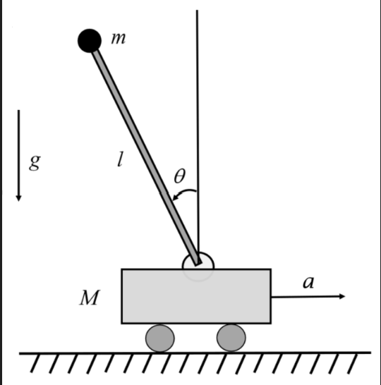

# Project CartPole - Lyapunov-based Control

*Energy-Based Swing-Up and LQR Stabilization*

This repository implements an energy-based controller for the Cart-Pole system, a classic underactuated robotic system. The project focuses on swinging the pendulum from the downward stable position to the upward unstable position using Lyapunov energy shaping, followed by a local LQR controller for precise asymptotic stabilization.

Project is about developing a control bounded system for an inverted pendulum (cartpole) based on Lyapunov functions.


## 📋 Brief description

The system consists of a cart and a pendulum attached to it. Control tasks:
1. **Swing-up**: Raise the pendulum from the downward (stable) position to the upward (unstable) position. (but it is not garanteed stability in an upper point)
2. **Stabilization**: Stabilize the pendulum in the upper unstable position (similarly)


**Run Project 1:**
```bash
cd Project_1_Lyapunov_based_control_cartpole/src
python main.py         
```
## 🔧 Architecture of Project
Project_1_Lyapunov_based_control_cartpole/  
├── src/    
│ ├── system.py # our cartpole model    
│ ├── controller.py # Lyapunov-based controller     
│ ├── simulation.py # data collection and simulation    
│ ├── visualization.py # visualization and animation   
│ └── main.py # initial start file   
├── configs/ # config files     
├── figures/ # graphics     
├── animations/ # video animation        
└── README.md       

## 1. System Description

| Symbol | Meaning |
|--------|---------|
| $x(t)$ | Cart position |
| $\theta(t)$ | Pendulum angle, **$\theta=0$ is upright** |
| $m_c$ | Cart mass |
| $m_p$ | Pendulum (point) mass |
| $l$ | Pendulum length (to center of mass) |
| $g$ | Gravitational acceleration |
| $a$ | Horizontal force applied to the cart |  



The Cart-Pole system consists of a cart of mass $m_c$ moving along the horizontal axis and a pendulum of mass $m_p$ and length $l$ attached to it. The state vector is defined as $[x, \dot{x}, \theta, \dot{\theta}]^\top$, where:
- $x(t)$: Cart position
- $\theta(t)$: Pendulum angle ($\theta=0$ corresponds to the upright position)
- $a(t)$: Horizontal control force applied to the cart

**Control-Bounded Formulation:** This problem is explicitly treated as a control-bounded system, where the actuator force is physically limited:
$$
|a(t)| \leq a_{\max}
$$

The equations of motion are derived using Lagrangian mechanics. For the complete step-by-step symbolic derivation (kinetic/potential energy, Euler-Lagrange equations, and acceleration solving), refer to [`system_analysis.ipynb`](system_analysis.ipynb). The final dynamic equations are:

$$
\ddot{x} = \frac{a - \frac{1}{2} m_p g \sin(2\theta) + l m_p \sin(\theta) \dot{\theta}^2}{m_c + m_p \sin^2(\theta)}
$$

$$
\ddot{\theta} = \frac{-a \cos(\theta) + (m_c + m_p) g \sin(\theta) - \frac{1}{2} m_p l \sin(2\theta) \dot{\theta}^2}{l (m_c + m_p \sin^2(\theta))}
$$

---

## 2. Energy Analysis
Before designing the controller, we analyzed the system's energy behavior in the uncontrolled case ($a = 0$). The total mechanical energy is defined as:

$$
E_{\text{total}} = \frac{1}{2}(m_c+m_p)\dot{x}^2 + \frac{1}{2}m_p l^2 \dot{\theta}^2 + m_p l \dot{x}\dot{\theta}\cos\theta + m_p g l \cos\theta
$$

### Uncontrolled System ($a = 0$)
By substituting the uncontrolled equations of motion into $\dot{E}_{\text{total}}$, we rigorously prove that:
$$
\dot{E}_{\text{total}}\big|_{a=0} = 0
$$
This confirms that the unforced system is conservative and marginally stable: energy is strictly conserved, and trajectories remain on constant-energy manifolds without any natural convergence to equilibrium.

### Controlled System
When control is applied, the time derivative of the total energy simplifies to the power balance identity:
$$
\dot{E}_{\text{total}} = a \dot{x}
$$
This fundamental relation shows that the control input acts directly as a power source/sink for the system. By appropriately choosing the sign and magnitude of $a$, we can intentionally inject or dissipate energy to drive the system toward the desired energy level.

---

## 3. Control Strategy

### 3.1 Full-Energy Lyapunov Control
We define the energy error as $\tilde{E} = E_{\text{total}} - E_{\text{des}}$, where $E_{\text{des}}$ is the target energy at the upright equilibrium. We choose the Lyapunov function candidate:
$$
V_L = \frac{1}{2} \tilde{E}^2 = \frac{1}{2}(E_{\text{total}} - E_{\text{des}})^2
$$

Taking the time derivative and substituting $\dot{E}_{\text{total}} = a \dot{x}$:
$$
\dot{V}_L = \tilde{E} a \dot{x}
$$

To ensure $\dot{V}_L \leq 0$, we select the control law:
$$
a = -k_E \tilde{E} \dot{x}, \quad k_E > 0
$$

Substituting this yields:
$$
\dot{V}_L = -k_E \tilde{E}^2 \dot{x}^2 \leq 0
$$

**Saturation Robustness:** In practice, actuators are bounded ($|a| \leq a_{\max}$). The saturated control is $a_{\text{sat}} = \text{clip}(-k_E \tilde{E} \dot{x}, -a_{\max}, a_{\max})$. Since saturation only reduces the magnitude but **preserves the sign** of the ideal control input, we have $\text{sign}(a_{\text{sat}}) = -\text{sign}(\tilde{E} \dot{x})$. Therefore:
$$
\dot{V}_L = \tilde{E} a_{\text{sat}} \dot{x} \leq 0 \quad \text{unconditionally}
$$
This makes the controller fundamentally robust to actuator saturation without requiring additional anti-windup or compensation terms.

**Convergence Limitation:** While energy convergence $E_{\text{total}} \to E_{\text{des}}$ guarantees the system reaches the target energy surface, it does not strictly guarantee convergence to the exact upright position $(x=0, \theta=0, \dot{x}=0, \dot{\theta}=0)$. Even at $E = E_{\text{des}}$, the system may settle into an oscillatory state where residual energy is stored as cart kinetic energy ($\dot{x} \neq 0$). Therefore, energy shaping alone is insufficient for asymptotic stabilization. Moreover, as it shown in [`system_analysis.ipynb`](system_analysis.ipynb) full energy may be equal to the desired one, while angle $\theta$ will not tend to the small neighbourhood of upright position ($\theta=0$). General proposition for this controller is to use it only when initially cart has a zero velocity ($\dot x =0$)

### 3.2 Pendulum-Energy Lyapunov Control (Future Work)
Therefore, an another solution was also proposed. As an alternative, we are investigating a pendulum-only energy Lyapunov function:
$$
V_P = \frac{1}{2}(E_{\text{pendulum}} - E_{\text{des}})^2
$$
This approach focuses solely on regulating the pendulum's energy, potentially decoupling the swing-up dynamics from the cart. Preliminary analysis indicates that this formulation introduces stricter analytical limitations on control bounds, which must be derived and validated. Implementation details and bound constraints will be provided in future updates.

### 3.3 Switch to LQR Stabilization
For both energy-based approaches, the energy-shaping controller cannot guarantee asymptotic convergence to the upright equilibrium due to the possibility of residual cart motion. To resolve this, we implement a hierarchical switching strategy:
1. **Energy-Shaping Phase:** The Lyapunov controller drives the system to the target energy surface.
2. **LQR Phase:** Once the state enters a small neighborhood of the upright equilibrium ($|\theta| < \theta_{th}, |\dot{\theta}| < \dot{\theta}_{th}, |x| < x_{th}, |\dot{x}| < \dot{x}_{th}$), the controller smoothly switches to a locally optimal Linear Quadratic Regulator (LQR) to achieve precise asymptotic stabilization and eliminate residual oscillations.

---

## 4. Results
### What we achieved    
All simulation outputs, phase portraits, energy convergence plots, and animations are automatically generated via [`visualization.py`](src/visualization.py). The implementation successfully demonstrates:
- ✅ Successful energy-based swing-up from the downward position.
- ✅ Monotonic decay of the Lyapunov function $V_L$ over time.
- ✅ Smooth transition to LQR stabilization near the upright position.
- ✅ Robust performance under strict actuator saturation limits.

Generated outputs are saved to:
- 📊 `figures/` — Static plots (time series, phase portraits, energy/Lyapunov evolution)
- 🎬 `animations/` — Real-time simulation GIFs/MP4s


---