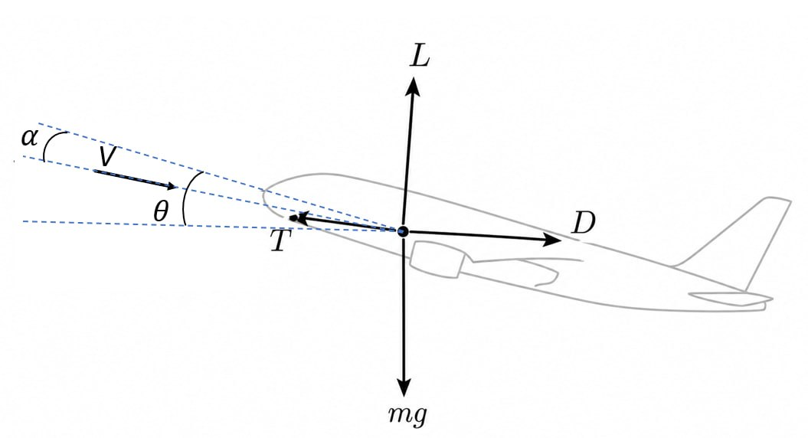
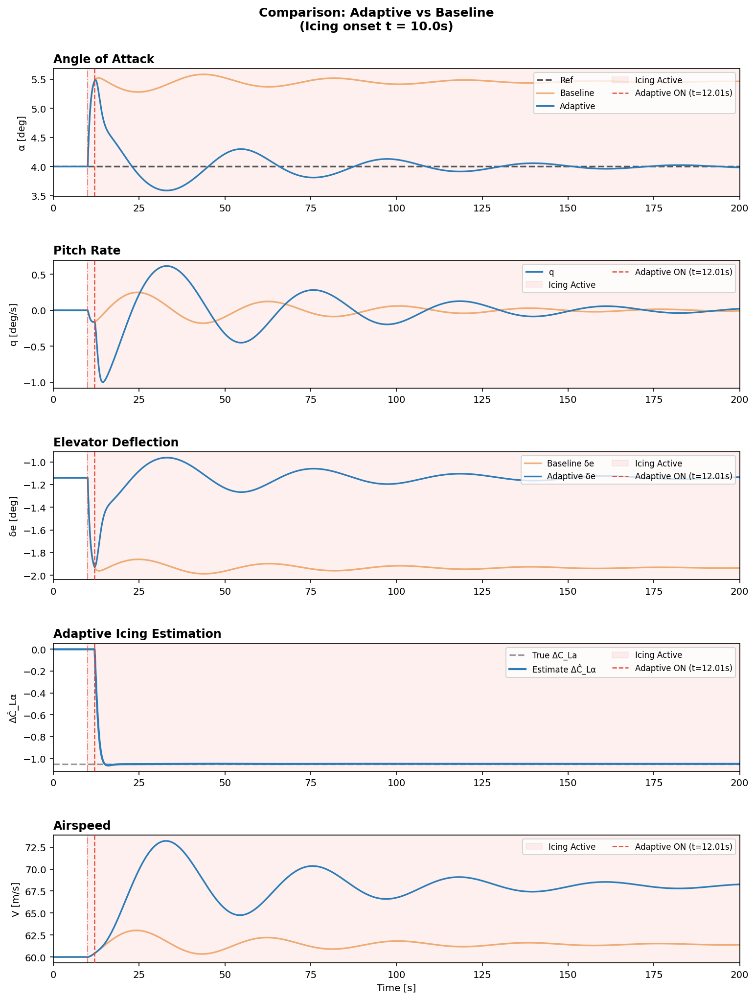
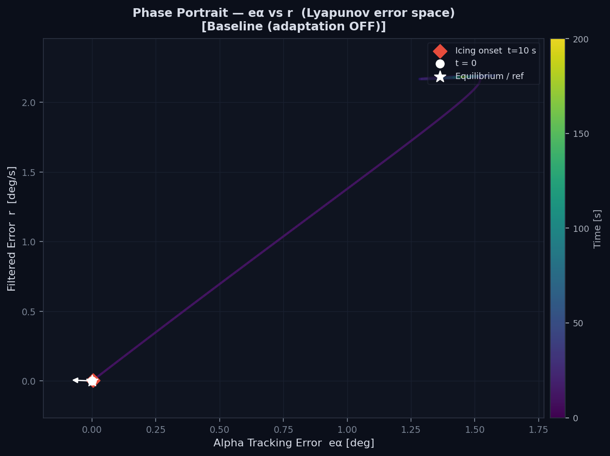
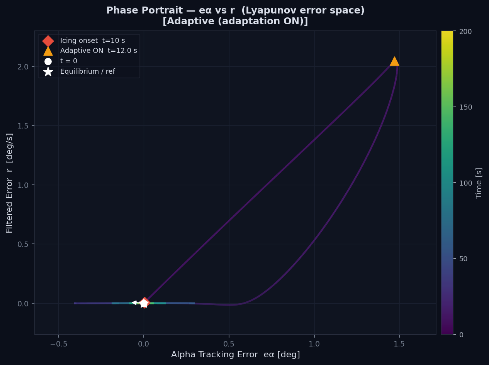
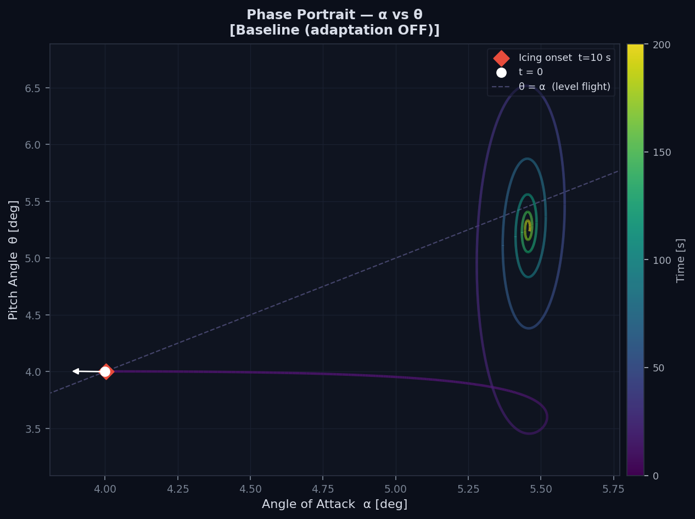
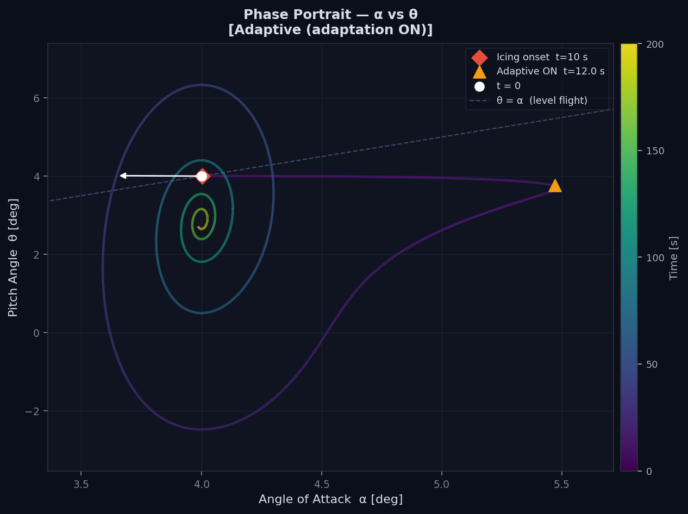
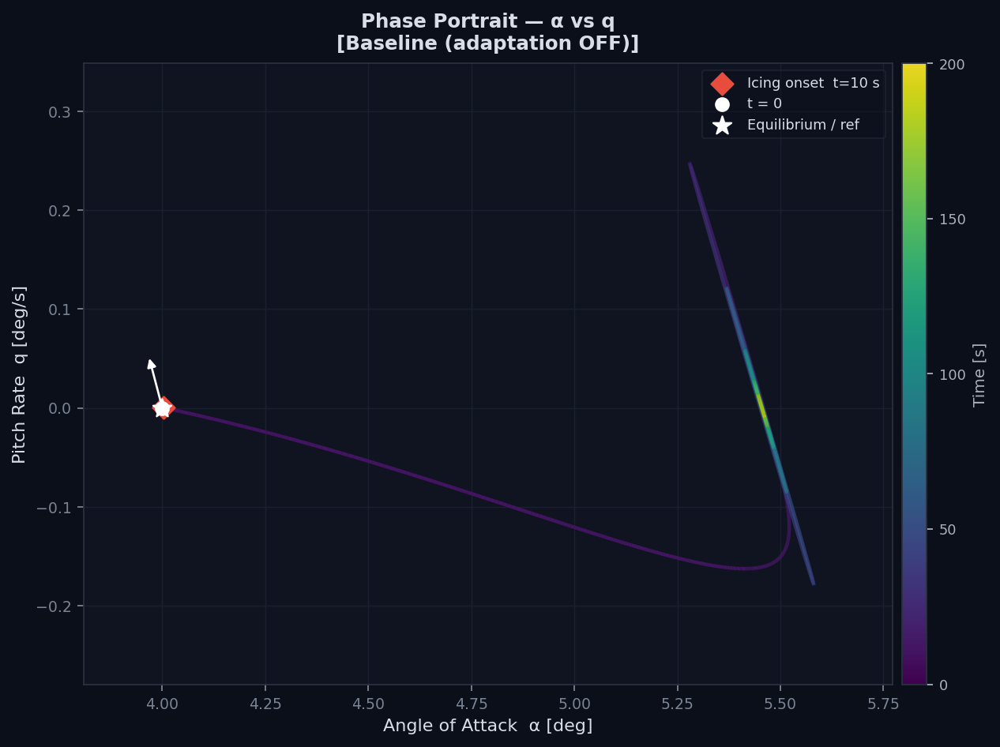
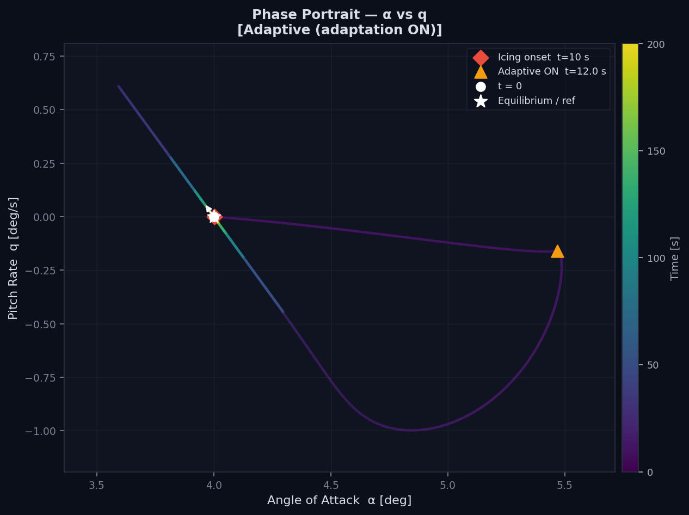

# 🛩️ Project Aircraft-Pitch-Rate adaptive control


**A simulation of a nonlinear longitudinal aircraft model subject to in-flight icing, with a Lyapunov-based adaptive controller that detects lift degradation and compensates for it in real time.**

The project includes 4-DOF physics model, both adaptive and baseline (nominal) controllers, static plots (time-series, phase portraits, Lyapunov function), and an interactive `pygame` visualisation with headless GIF export.

---

## 📋 Brief Description

Airframe icing reduces the lift-curve slope $C_{L\alpha}$, destabilising the pitch axis and forcing the elevator to work harder to hold a reference angle of attack. The adaptive controller detects this degradation automatically using a Lyapunov-based switching law.

| Component | Description |
|-----------|-------------|
| **Baseline controller** | Fixed Lyapunov nominal elevator law with no realtime estimation |
| **Adaptive controller** | Augments nominal law with real time parameter estimator for $\Delta C_{L\alpha}$ that activates once anomalous tracking errors are detected |
| **Aircraft dynamics** | Nonlinear longitudinal equations of motion  |

> **Mathematical reference**: The complete derivation of the longitudinal aircraft model, aerodynamic scaling, and control law is provided in `model_draft.md` and `lyapunov_icing_controller_final_description.md`.

---

**Run Project 2:**
```bash
cd Project_2_Adaptive_control_Pitch_plane/src
python main.py         
```
---
## 🔧 Architecture of Project
Project_2_Adaptive_control_Pitch_plane/  
├── src/    
│ ├── system.py # our cartpole model    
│ ├── controller.py # Project used controllers     
│ ├── simulation.py # data collection and simulation    
│ ├── visualization.py # visualization and animation   
│ └── main.py # initial start file   
├── configs/ # config files     
├── figures/ # graphics     
├── animations/ # GIF animation        
└── README.md   


## 1. System Description & Symbol Dictionary

*Full mathematical derivation: `model_draft.md` §1-2, `lyapunov_icing_controller_final_description.md` §1*


*Scheme only for main idea reference. Description of symbols below.

### State & Control Vectors

$$
s = \begin{bmatrix} V \\ \alpha \\ q \\ \theta \end{bmatrix} \in \mathbb{R}^4, \qquad
a = \begin{bmatrix} \delta_e \\ \delta_t \end{bmatrix} \in \mathbb{R}^2
$$

| Symbol | Meaning | Units |
|--------|---------|-------|
| $s$ | State vector | – |
| $V$ | True airspeed | m/s |
| $\alpha$ | Angle of attack (wind-axis) | rad |
| $q$ | Pitch rate about lateral axis | rad/s |
| $\theta$ | Pitch angle relative to horizon | rad |
| $a$ | Control (action) vector | – |
| $\delta_e$ | Elevator deflection | rad |
| $\delta_t$ | Throttle command (normalized) | – |

### Nonlinear Dynamics

$$
\boxed{\dot{s} = P(s, a) + d(t)}
$$

**Explicit form of $P(s,a)$**:

$$
P(s,a) = \begin{bmatrix}
\displaystyle \frac{1}{m}\Big[ T(\delta_t)\cos\alpha - D(V,\alpha,\delta_e) - mg\sin\gamma \Big] \\[8pt]
\displaystyle q - \frac{1}{mV}\Big[ T(\delta_t)\sin\alpha + L(V,\alpha,\delta_e) - mg\cos\gamma \Big] \\[8pt]
\displaystyle \frac{1}{I_y} M(V,\alpha,q,\delta_e) \\[8pt]
q
\end{bmatrix}, \quad \gamma = \theta - \alpha
$$

| Symbol | Meaning | Units |
|--------|---------|-------|
| $\dot{s}$ | State derivative | varies |
| $P(s,a)$ | Nominal dynamics vector field | varies |
| $d(t) \in \mathbb{R}^4$ | Additive disturbance (gusts, noise) | varies |
| $m$ | Aircraft mass | kg |
| $g$ | Gravitational acceleration | m/s² |
| $\gamma$ | Flight-path angle | rad |
| $I_y$ | Pitch moment of inertia | kg·m² |
| $T$ | Thrust force | N |
| $L, D$ | Lift / Drag forces | N |
| $M$ | Pitching moment | N·m |

---

## 2. Aerodynamics & Icing Model

*Full derivation: `model_draft.md` §2, `lyapunov_icing_controller_final_description.md` §2*

### Dynamic Pressure & Force Scaling

From Bernoulli's equation and Buckingham $\pi$ theorem:

$$
\bar{q} \triangleq \frac{1}{2}\rho V^2, \qquad F = \bar{q} S C_F = \frac{1}{2}\rho V^2 S C_F
$$

| Symbol | Meaning | Units |
|--------|---------|-------|
| $\bar{q}$ | Dynamic pressure | Pa |
| $\rho$ | Air density | kg/m³ |
| $S$ | Wing reference area | m² |
| $C_F$ | Dimensionless aerodynamic coefficient | – |

### Lift, Drag, Moment Coefficients

$$
\begin{aligned}
C_L &= C_{L0} + C_{L\alpha}\alpha + C_{L\delta_e}\delta_e \\
C_D &= C_{D0} + \frac{\big(C_{L\alpha}\alpha + C_{L\delta_e}\delta_e\big)^2}{\pi e \cdot \mathrm{AR}} \\
C_m &= C_{m0} + C_{m\alpha}\alpha + C_{mq}\underbrace{\left(\frac{q\bar{c}}{2V}\right)}_{\hat{q}} + C_{m\delta_e}\delta_e
\end{aligned}
$$

| Symbol | Meaning | Units |
|--------|---------|-------|
| $C_L, C_D, C_m$ | Lift/drag/moment coefficients | – |
| $C_{L0}, C_{D0}, C_{m0}$ | Zero-angle coefficients | – |
| $C_{L\alpha}$ | Lift-curve slope | rad⁻¹ |
| $C_{L\delta_e}$ | Lift derivative w.r.t. elevator | rad⁻¹ |
| $C_{m\alpha}$ | Pitch stiffness derivative | rad⁻¹ |
| $C_{mq}$ | Pitch damping derivative | – |
| $C_{m\delta_e}$ | Elevator effectiveness | rad⁻¹ |
| $\bar{c}$ | Mean aerodynamic chord | m |
| $\hat{q} = \frac{q\bar{c}}{2V}$ | Dimensionless pitch rate | – |
| $\mathrm{AR} = b^2/S$ | Wing aspect ratio | – |
| $e$ | Oswald efficiency factor | – |

### Icing Physical Model

Icing reduces the lift-curve slope at time $t_{\mathrm{ice}}$:

$$
C_{L\alpha}(t) = C_{L\alpha}^{\mathrm{clean}} + \Delta C_{L\alpha}(t), \quad
\Delta C_{L\alpha}(t) = \begin{cases} 0, & t < t_{\mathrm{ice}} \\ \Delta C_{L\alpha}^{\mathrm{ice}} < 0, & t \geq t_{\mathrm{ice}} \end{cases}
$$

The icing-induced perturbation to $\dot{\alpha}$ dynamics:

$$
\boxed{\Delta\dot{\alpha}_{\mathrm{ice}} = \frac{1}{2}\frac{\rho V S}{m} \alpha \Delta C_{L\alpha}}
$$

| Symbol | Meaning | Units |
|--------|---------|-------|
| $t_{\mathrm{ice}}$ | Icing onset time | s |
| $\Delta C_{L\alpha}$ | Lift-curve slope degradation | rad⁻¹ |
| $\Delta\dot{\alpha}_{\mathrm{ice}}$ | Icing perturbation to AoA rate | rad/s |

---

## 3. Control Strategy & Lyapunov Proofs

*Full derivation: `lyapunov_icing_controller_final_description.md` §4-9*

### 3.1 Filtered Error & Reduced Dynamics

Define tracking errors and filtered error:

$$
e_\alpha = \alpha - \alpha_{\mathrm{ref}}, \quad e_q = q - q_{\mathrm{ref}}, \quad \boxed{r = e_q + \lambda_\alpha e_\alpha}
$$

The reduced scalar dynamics for $r$:

$$
\boxed{\dot{r} = F(s) + B(s)\delta_e + Y(s)\Delta C_{L\alpha}}
$$

| Symbol | Meaning | Units |
|--------|---------|-------|
| $e_\alpha, e_q$ | Tracking errors | rad, rad/s |
| $r$ | Filtered tracking error | rad/s |
| $\lambda_\alpha > 0$ | Filter blending weight | – |
| $F(s)$ | Nominal pitch/AoA dynamics | rad/s² |
| $B(s)$ | Elevator authority term | rad/s²/rad |
| $Y(s)$ | Icing regressor term | rad/s²/rad⁻¹ |

### 3.2 Nominal Lyapunov Controller (Clean Wing)

Before icing ($\Delta C_{L\alpha}=0$), impose $\dot{r} = -k_r r$:

$$
\boxed{\delta_{e,\mathrm{nom}} = \frac{-F(s) - k_r r}{B(s)}}
$$

**Lyapunov proof**: $\mathcal{V}_0 = \frac{1}{2}r^2 \quad \Rightarrow \quad \dot{\mathcal{V}}_0 = -k_r r^2 \leq 0$

| Symbol | Meaning | Units |
|--------|---------|-------|
| $k_r > 0$ | Lyapunov convergence gain | s⁻¹ |
| $\delta_{e,\mathrm{nom}}$ | Nominal elevator command | rad |
| $\mathcal{V}_0$ | Nominal Lyapunov candidate | – |

### 3.3 Adaptive Switching Controller (Iced Wing)

After icing, introduce estimate $\widehat{\Delta C}_{L\alpha}$ and error $\widetilde{\Delta C}_{L\alpha} = \widehat{\Delta C}_{L\alpha} - \Delta C_{L\alpha}$:

$$
\boxed{\delta_e =
\frac{-F(s) - k_r r - Y(s)\widehat{\Delta C}_{L\alpha}}{B(s)}
},
\qquad
\boxed{
\dot{\widehat{\Delta C}}_{L\alpha} = \gamma_C Y(s)r
}
$$

**Composite Lyapunov proof**:

$$
\boxed{\mathcal{V} = \frac{1}{2}r^2 + \frac{1}{2\gamma_C}\widetilde{\Delta C}_{L\alpha}^2} \quad \Rightarrow \quad \dot{\mathcal{V}} = -k_r r^2 \leq 0
$$

| Symbol | Meaning | Units |
|--------|---------|-------|
| $\widehat{\Delta C}_{L\alpha}$ | Online estimate of lift degradation | rad⁻¹ |
| $\widetilde{\Delta C}_{L\alpha}$ | Estimation error | rad⁻¹ |
| $\gamma_C > 0$ | Adaptation gain | s⁻¹·rad |
| $\mathcal{V}$ | Composite Lyapunov function | – |
| $\delta_{e,\mathrm{adapt}}$ | Adaptive correction term | rad |

### 3.4 Switching Logic & Saturation

Adaptive mode activates when errors exceed thresholds for `detect_steps` consecutive samples:

$$
\mathrm{adaptive\_mode} =
\begin{cases}
\mathrm{True}, &
\left|e_\alpha\right| > e_{\alpha,\mathrm{thr}}
\;\land\;
\left|r\right| > r_{\mathrm{thr}}
\;\land\;
N \geq \mathrm{detect\_steps},\\
\mathrm{False}, & \mathrm{otherwise}.
\end{cases}
$$

Projection and saturation enforce physical bounds:

$$
\widehat{\Delta C}_{L\alpha}
\leftarrow
\operatorname{clip}
\left(\widehat{\Delta C}_{L\alpha},\, \Delta C_{\min},\, 0\right),
\qquad
\delta_e
\leftarrow
\operatorname{clip}
\left(\delta_e,\, -\delta_{e,\max},\, +\delta_{e,\max}\right)
$$

| Symbol | Meaning | Units |
|--------|---------|-------|
| $e_{\alpha,\mathrm{thr}}$ | AoA error detection threshold | rad |
| $r_{\mathrm{thr}}$ | Filtered error detection threshold | rad/s |
| $\mathrm{detect\_steps}$ | Consecutive detections to trigger | – |
| $\Delta C_{\min}$ | Lower projection bound for estimate | rad⁻¹ |
| $\delta_{e,\max}$ | Elevator saturation limit | rad |

---

## 4. Parameters Reference

*Source: `project_description.md`, `lyapunov_icing_controller_final_description.md` §11*

### Aircraft & Aerodynamic Parameters

| Symbol | Value | Units | Meaning |
|--------|-------|-------|---------|
| $m$ | 1200.0 | kg | Aircraft mass |
| $I_y$ | 1800.0 | kg·m² | Pitch moment of inertia |
| $S$ | 16.2 | m² | Wing reference area |
| $\bar{c}$ | 1.5 | m | Mean aerodynamic chord |
| $T_{\max}$ | 3000.0 | N | Maximum thrust at $\delta_t=1$ |
| $\rho$ | 1.225 | kg/m³ | Sea-level air density |
| $C_{L\alpha}$ | 3.50 | rad⁻¹ | Clean lift-curve slope |
| $C_{m\alpha}$ | −0.60 | rad⁻¹ | Pitch stiffness ($<0$ → stable) |
| $C_{mq}$ | −8.00 | – | Pitch damping |
| $C_{m\delta_e}$ | −1.10 | rad⁻¹ | Elevator effectiveness |
| $C_{D0}$ | 0.027 | – | Zero-lift parasitic drag |
| $\mathrm{AR}$ | 7.32 | – | Wing aspect ratio |
| $e$ | 0.81 | – | Oswald efficiency factor |

### Controller Parameters

| Symbol | Value | Units | Meaning |
|--------|-------|-------|---------|
| $\lambda_\alpha$ | 1.5 | – | Filtered-error blending weight |
| $k_r$ | 2.0 | s⁻¹ | Lyapunov damping coefficient |
| $\gamma_C$ | 300.0 | s⁻¹·rad | Adaptation gain |
| $\Delta C_{\min}$ | −3.0 | rad⁻¹ | Lower bound for $\widehat{\Delta C}_{L\alpha}$ |
| $\delta_{e,\max}$ | 25° | rad | Elevator actuator limit |
| $e_{\alpha,\mathrm{thr}}$ | 3° | rad | AoA error trigger threshold |
| $r_{\mathrm{thr}}$ | 2°/s | rad/s | Filtered error trigger threshold |
| $\mathrm{detect\_steps}$ | 20 | – | Consecutive detections to activate adaptation |

---

## 5. Additional interaction control


**Interactive Pygame Controls**:

| Key | Action | Key | Action |
|-----|--------|-----|--------|
| `SPACE` / `→` | Step forward | `←` | Step backward |
| `R` | Restart | `A` | Toggle auto-play |
| `+` / `-` | Speed control | `S` / `G` | Save PNG / Export GIF |
| `Q` / `Esc` | Quit | Click scrubber | Seek to time |

---

## 6. Results
Icing was introduced at $t=10\,s$, and adaptive control was activated at approximately $t=12.01\,s$. After icing, the baseline controller remains stable but develops a steady tracking error: the angle of attack increases from about $4^\circ$ to $5.4^\circ$. This occurs because the reduced lift-curve slope $C_{L\alpha}$ lowers lift generation and shifts the longitudinal equilibrium.



The adaptive controller shows a short transient after icing, but then returns $\alpha$ close to the reference value and damps the pitch rate $q$ toward zero. The estimate $\widehat{\Delta C}_{L_\alpha}$ converges to the imposed degradation, confirming that the controller correctly compensates for the loss of lift effectiveness.

The phase portraits support this result. In the Lyapunov error space, the baseline trajectory settles in a nonzero error region, while the adaptive trajectory returns toward the desired equilibrium after activation.





The $\alpha$-$\theta$ portraits show that the baseline system shifts to a new post-icing operating point with higher angle of attack and pitch angle. The adaptive controller produces a larger transient because it actively changes the elevator command, but then restores the controlled inner-loop behavior.





The $\alpha$-$q$ portraits confirm the same conclusion: the baseline controller keeps the system bounded but away from the original reference, whereas the adaptive controller returns the motion toward $\alpha \approx 4^\circ$ and $q \approx 0$.




---

## 📝 Discussion & Limitations

The baseline nominal controller successfully tracks $\alpha_{\mathrm{ref}}$ in clean conditions but exhibits steady-state error and increased control effort once icing reduces $C_{L\alpha}$. The adaptive controller detects the anomaly via the filtered error $r$, activates the parameter estimator, and converges $\widehat{\Delta C}_{L\alpha}$ to the true degradation value. The composite Lyapunov function guarantees $\dot{\mathcal{V}} \leq 0$, ensuring bounded signals and asymptotic tracking recovery **under the assumptions listed in `lyapunov_icing_controller_final_description.md` §10**.

---

## AI guidance

Aknowledgement usage of AI for theoretical information research and vizualisation of the results. Help of tuning the controller.