# Project 3 – Backstepping Control of a nonlinear Flexible-Joint Drive
**A simulation of a nonlinear motor system with cubic torsional stiffness and smooth friction, controlled via a recursive Lyapunov-based backstepping law.**

The project includes a 4-DOF nonlinear plant model, nominal backstepping controller, baseline comparison, static plots (time-series, phase portraits, Lyapunov function evolution), and an interactive `pygame` visualisation with GIF export.


📋 Brief Description    
 The backstepping controller recursively stabilises load position by treating transmitted torque as a virtual control, guaranteeing asymptotic tracking without linearisation or gain scheduling. 
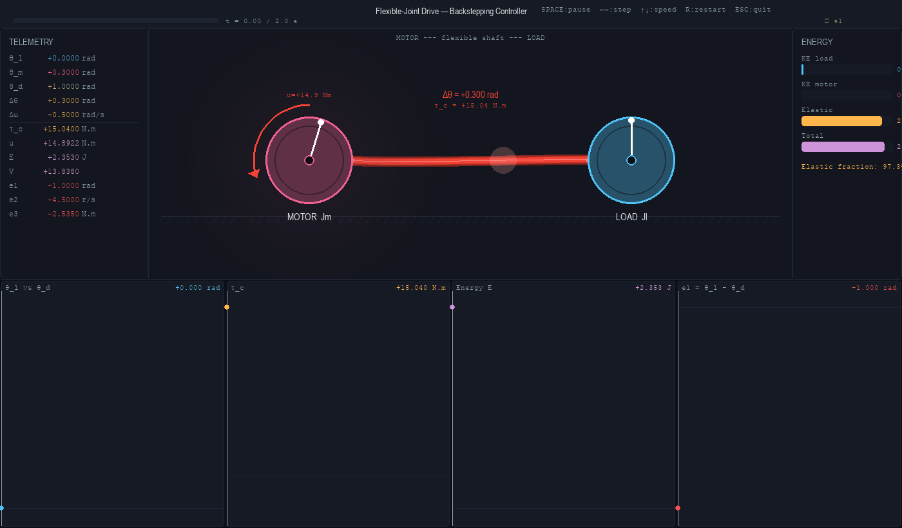

| Component | Description |
|-----------|-------------|
| **Baseline controller** | PID and PD tuned at small-signal equilibrium; loses damping during large twist or friction saturation |
| **Backstepping controller** | Recursive Lyapunov design using coupling torque as virtual control; exact cancellation of $k_3\delta^3$ and $T_f(\omega)$|
| **Flexible-joint dynamics** | Nonlinear non-collocated mechanical system with cubic stiffness & smooth Coulomb-viscous friction |

The complete derivation of the nonlinear state-space model, possible implementation current-actuator mapping, energy passivity analysis, and recursive backstepping control law with stability proofs is provided in [model_motor_draftV3.md](model_motor_draftV3.md) and [readme_flexible_joint_backstepping_theory_v2.md](readme_flexible_joint_backstepping_theory_v2.md).

## 1. Usage
### Requirements
```
pip install numpy scipy matplotlib pygame Pillow
```
### Repository structure

```
Project_3_Backstepping_Flexible_Joint_Drive/
├── src/
│   ├── system.py          # nonlinear flexible-joint plant model
│   ├── controller.py      # backstepping & baseline controllers
│   ├── simulation.py      # data collection & numerical integration
│   ├── visualization.py   # matplotlib plots & pygame animation
│   └── main.py            # entry point & CLI parser
├── figures/               # static plots (PNG/PDF)
├── animations/            # GIF exports
├── code_description.md    # repository guide & CLI reference
├── model_motor_draftV3.md # detailed nonlinear plant derivation
├── readme_flexible_joint_backstepping_theory_v2.md # control law, current actuation & Lyapunov proofs
└── README.md
```
All commands are run from the `src/` directory:

```bash
cd src
python main.py [--scenario SCENARIO] [plot flags] [--t_end T] [--animate] [--gif]
```

---

### Scenarios

The `--scenario` flag selects what to simulate and which controllers to run.

| Scenario | Description |
|---|---|
| `equilibrium` | Backstepping stabilises from a perturbed initial condition to $\theta^\ast = 1\,\text{rad}$ — the scenario covered by the Lyapunov proof *(default)* |
| `step` | Backstepping tracks a smooth sigmoid step reference |
| `sin` | Backstepping tracks a sinusoidal reference at 0.4 Hz |
| `ctrl_compare` | Backstepping vs PD vs PID on a smooth step trajectory |
| `ctrl_compare_eq` | Backstepping vs PD vs PID on the equilibrium scenario |
| `ctrl_compare_sin` | Backstepping vs PD vs PID on a sinusoidal reference at 0.4 Hz |

---

### Plot flags

Each flag produces one figure saved to `figures/` with the scenario name as a prefix.

| Flag | Output file | Contents |
|---|---|---|
| `--plots` | `<scenario>_states.png` | Angular positions, velocities, coupling torque, control input, tracking errors — full simulation horizon |
| `--tail` | `<scenario>_states_tail.png` | Same panels zoomed into the last 1 s — reveals steady-state offsets invisible at full scale |
| `--phase` | `<scenario>_phase_portraits.png` | Load-side $(\theta_l, \omega_l)$ and motor-side $(\theta_m, \omega_m)$ phase portraits, colour encodes time |
| `--lyapunov` | `<scenario>_lyapunov.png` | Lyapunov function $V(t)$ and $\dot V$ (backstepping only) and total mechanical energy $E(t)$ (all controllers) |
| `--shaft` | `<scenario>_shaft_dynamics.png` | Shaft twist $\Delta\theta$, relative velocity $\Delta\omega$, elastic potential $E_s$, internal phase portrait |
| `--all` | all of the above | Shorthand for `--plots --tail --phase --lyapunov --shaft` |

---

### Animation flags

| Flag | Effect |
|---|---|
| `--animate` | Opens an interactive pygame window — motor and load disks rotate in real time, the shaft colour encodes coupling torque, live telemetry and scrolling plots update at the bottom |
| `--gif` | Renders every frame offline at the correct simulation speed and saves a GIF to `animations/` for each controller in the current scenario. Requires Pillow (`pip install Pillow`) |

Keyboard controls in the interactive window:

| Key | Action |
|---|---|
| `Space` | Pause / resume |
| `←` / `→` | Step one frame |
| `↑` / `↓` | Double / halve playback speed |
| `R` | Restart from frame 0 |
| `Esc` / `Q` | Quit |

---

### Simulation duration

```bash
python main.py --scenario equilibrium --plots --t_end 15
```

The default is 10 seconds. Longer runs are useful for checking whether PD/PID steady-state offsets continue to drift.

---

### Common recipes

Reproduce all figures used in this README:

```bash
python main.py --all --scenario equilibrium --t_end 10
python main.py --all --scenario ctrl_compare_eq --t_end 10
```

Generate the comparison GIFs:

```bash
python main.py --gif --animate --scenario ctrl_compare_eq --t_end 2
```

Run a quick sanity check (simulation only, no output):

```bash
python main.py --scenario equilibrium
```

---

### Tuning controller gains

Gains are set as defaults in `controller.py` and can be overridden programmatically by importing the gain dataclasses:

```python
from controller import ControllerGains, PDGains, PIDGains
from simulation import run_simulation

# Backstepping
r = run_simulation(
    controller_type="backstepping",
    ctrl_gains=ControllerGains(k1=5.0, k2=8.0, k3=10.0, k4=15.0),
    reference="equilibrium",
    ref_kwargs={"setpoint": 1.0},
)

# PD
r = run_simulation(
    controller_type="pd",
    pd_gains=PDGains(Kp=10.0, Kd=3.0),
    reference="equilibrium",
    ref_kwargs={"setpoint": 1.0},
)

# PID
r = run_simulation(
    controller_type="pid",
    pid_gains=PIDGains(Kp=10.0, Ki=1.0, Kd=3.0),
    reference="equilibrium",
    ref_kwargs={"setpoint": 1.0},
)
```

Default gains used in this project:

| Controller | Parameter | Value |
|---|---|---|
| Backstepping | $k_1$ | 5.0 |
| | $k_2$ | 8.0 |
| | $k_3$ | 10.0 |
| | $k_4$ | 15.0 |
| PD | $K_p$ | 10.0 |
| | $K_d$ | 3.0 |
| PID | $K_p$ | 10.0 |
| | $K_i$ | 1.0 |
| | $K_d$ | 3.0 |


## 2. System Description & Symbol Dictionary
Full mathematical derivation: [model_motor_draftV3.md](model_motor_draftV3.md) §1-2, [readme_flexible_joint_backstepping_theory_v2.md](readme_flexible_joint_backstepping_theory_v2.md) §1

*Scheme with meanings only for main idea reference. Description of symbols below.*
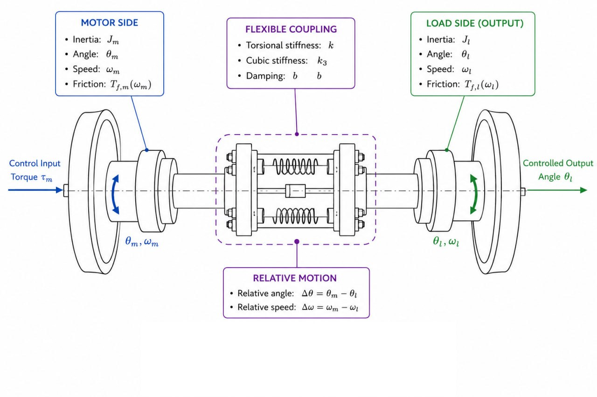

**State & Control Vectors**

$$s = \begin{bmatrix} \theta_l \\
\omega_l \\ 
\theta_m \\ 
\omega_m \end{bmatrix} \in \mathbb{R}^4$$

$$a = \tau_m  \in \mathbb{R}$$

| Symbol | Meaning | Units |
|--------|---------|-------|
| $s$ | State vector | – |
| $\theta_l$ | Load angular position | rad |
| $\omega_l$ | Load angular velocity | rad/s |
| $\theta_m$ | Motor angular position | rad |
| $\omega_m$ | Motor angular velocity | rad/s |
| $a$ | Action- Control input | N·m  |
| $\tau_m $ | Motor electromagnetic torque | N·m |

**Nonlinear Dynamics**

$$\boxed{\dot{s} = f(s) + g a + d(t)}$$

where $g = [0, 0, 0, 1/J_m]^\top$ and $d(t) = [0, d_l(t), 0, d_m(t)]^\top$ represents bounded acceleration disturbances.

**NOTE:** The terms $d_l(t)$ and $d_m(t)$ represent bounded acceleration disturbances due to unmodeled payload variations, external torque perturbations, and parameter identification errors. For the nominal backstepping synthesis, we assume $d_l(t) \equiv d_m(t) \equiv 0$ to focus on exact nonlinear cancellation.

Explicit form:

$$\begin{aligned}
\dot{s}_1 &= s_2 \\
\dot{s}_2 &= \frac{1}{J_l}\Bigl[ k(s_3-s_1) + k_3(s_3-s_1)^3 + b(s_4-s_2) - T_{f,l}(s_2) \Bigr] + d_l(t) \\
\dot{s}_3 &= s_4 \\
\dot{s}_4 &= \frac{1}{J_m}\Bigl[ K_t u - k(s_3-s_1) - k_3(s_3-s_1)^3 - b(s_4-s_2) - T_{f,m}(s_4) \Bigr] + d_m(t)
\end{aligned}$$

| Symbol | Meaning | Units |
|--------|---------|-------|
| $\dot{s}$ | State derivative | varies |
| $f(s), g$ | Drift & input vector fields | varies |
| $J_l, J_m$ | Load & motor inertia | kg·m² |
| $k, k_3, b$ | Linear/cubic stiffness, damping | N·m/rad, N·m/rad³, N·m·s/rad |
| $T_{f,l}, T_{f,m}$ | Smooth friction torques | N·m |
| $d_l, d_m$ | Bounded acceleration disturbances | rad/s² |
| $K_t$ | Motor torque constant | N·m/A |

## 3. Nonlinear Coupling & Friction Model
Full derivation: [model_motor_draftV3.md](model_motor_draftV3.md) §2, [readme_flexible_joint_backstepping_theory_v2.md](readme_flexible_joint_backstepping_theory_v2.md) §1-4

**Relative Coordinates & Transmitted Torque**   
From kinematic coupling and constitutive shaft behaviour:

$$\delta \triangleq \theta_m - \theta_l = s_3 - s_1, \qquad \nu \triangleq \omega_m - \omega_l = s_4 - s_2$$

The elastic-dissipative torque transmitted through the flexible shaft is:

$$\tau_c = k\delta + k_3\delta^3 + b\nu$$

| Symbol | Meaning | Units |
|--------|---------|-------|
| $\delta, \nu$ | Shaft twist & relative velocity | rad, rad/s |
| $k$ | Linear torsional stiffness | N·m/rad |
| $k_3$ | Cubic hardening coefficient | N·m/rad³ |
| $b$ | Structural damping | N·m·s/rad |
| $\tau_c$ | Coupling torque | N·m |

Elastic potential energy: $U(\delta) = \frac{1}{2}k\delta^2 + \frac{1}{4}k_3\delta^4$, confirming $\partial U/\partial \delta = k\delta + k_3\delta^3$.

**Smooth Friction Approximation**
To preserve differentiability for Lyapunov synthesis, discontinuous Coulomb friction is approximated by a hyperbolic tangent:
$$T_f(\omega) = F_c \tanh\left(\frac{\omega}{v_s}\right) + B_v \omega$$
| Symbol | Meaning | Units |
|--------|---------|-------|
| $F_c$ | Coulomb friction level | N·m |
| $v_s$ | Stribeck smoothing threshold | rad/s |
| $B_v$ | Viscous friction coefficient | N·m·s/rad |

The $\tanh(\cdot)$ function is $C^\infty$ everywhere, with derivative $\frac{d}{d\omega}T_f = \frac{F_c}{v_s}sech^2(\omega/v_s) + B_v$. This guarantees smooth recursive backstepping differentiation and avoids Filippov nonsmooth analysis. Near zero velocity, $T_f(\omega) \approx (F_c/v_s + B_v)\omega$, acting as enhanced viscous damping.

## 4. Control Strategy & Lyapunov Proofs
Full derivation: [readme_flexible_joint_backstepping_theory_v2.md](readme_flexible_joint_backstepping_theory_v2.md) §7-10, §13

### 4.1 Error Coordinates & Virtual Controls
Define tracking error and first virtual control:

$$z_1 = \theta_l - \theta_d, \quad \alpha_1 = \dot{\theta}_d - c_1 z_1, \quad z_2 = \omega_l - \alpha_1$$

The load velocity error dynamics:

$$\dot{z}_2 = \frac{1}{J_l}\left(\tau_c - T_{f,l}\right) - \dot{\alpha}_1$$

### 4.2 Desired Coupling Torque 
Treat $\tau_c$ as intermediate virtual control. Choose:

$$\tau_c^* = J_l\left(\dot{\alpha}_1 - c_2 z_2 - z_1\right) + T_{f,l}$$

Define torque tracking error: $z_3 = \tau_c - \tau_c^*$. Then:

$$\dot{z}_2 = -c_2 z_2 - z_1 + \frac{1}{J_l}z_3$$

### 4.3 Final Backstepping Law & Current Mapping 
The coupling torque derivative is $\dot{\tau}_c = \frac{b }{J_m}a + \Phi(x)$, where $\Phi(x)$ contains known nonlinearities and:     

$$\Phi(x) = (k+3k_3\delta^2)\nu - b\left(\frac{1}{J_m}+\frac{1}{J_l}\right)\tau_c - \frac{b}{J_m}T_{f,m} + \frac{b}{J_l}T_{f,l}$$

 The backstepping design with motor torque:

$$\boxed{a = \frac{J_m}{b}\left[-\Phi(x) + \dot{\tau}_c^* - c_3 z_3 - \frac{1}{J_l}z_2\right]}$$

For practical actuation, torque is usually realised via motor current $i$:

$$\boxed{i^* = \frac{\tau_m^*}{K_t}}$$

Under ideal current tracking ($K_t i \approx \tau_m^*$=a), the mechanical closed-loop dynamics remain unchanged. But in our model we were mainly focused on how to cope with a lot of nonlinearities, in that case we just showed that we know how to control motor in real life but in our exact example we control straightly torque.

| Symbol | Meaning | Units |
|--------|---------|-------|
| $z_1, z_2, z_3$ | Tracking & torque errors | rad, rad/s, N·m |
| $c_1, c_2, c_3 > 0$ | Backstepping convergence gains | s⁻¹ |
| $\Phi(x)$ | Known nonlinear drift | N·m/s |
| $\tau_c^*$ | Desired elastic torque | N·m |
| $K_t$ | Torque constant | N·m/A |

### 4.4 Lyapunov Stability Proof
Composite Lyapunov candidate:

$$\boxed{\mathcal{V} = \frac{1}{2}z_1^2 + \frac{1}{2}z_2^2 + \frac{1}{2}z_3^2}$$

Derivative under closed-loop dynamics:

$$\dot{\mathcal{V}} = -c_1 z_1^2 - c_2 z_2^2 - c_3 z_3^2 \leq 0$$

Since $\dot{\mathcal{V}}$ is negative definite, $z_1(t), z_2(t), z_3(t) \to 0$ asymptotically. The internal shaft dynamics $b\dot{\delta} + k\delta + k_3\delta^3 = \tau_c$ are input-to-state stable (ISS), guaranteeing bounded twist under bounded control.  
 Not in our case, but in addition about how to cope with current: Current saturation $|i| \leq i_{\max}$ introduces local stability margins but preserves convergence within actuator authority.

## 5. Parameters Reference
Source: [model_motor_draftV3.md](model_motor_draftV3.md) §7, [readme_flexible_joint_backstepping_theory_v2.md](readme_flexible_joint_backstepping_theory_v2.md) §13

**System Parameters (Lab-Scale Flexible Joint)**
| Symbol | Value | Units | Meaning |
|--------|-------|-------|---------|
| $J_l$ | 0.025 | kg·m² | Load inertia |
| $J_m$ | 0.0032 | kg·m² | Motor rotor inertia |
| $k$ | 12.5 | N·m/rad | Linear shaft stiffness |
| $k_3$ | 300 | N·m/rad³ | Cubic hardening coefficient |
| $b$ | 0.15 | N·m·s/rad | Coupling damping |
| $F_{c,l}, F_{c,m}$ | 0.08, 0.04 | N·m | Coulomb friction levels |
| $v_{s,l}, v_{s,m}$ | 0.05, 0.03 | rad/s | Stribeck thresholds |
| $B_{v,l}, B_{v,m}$ | 0.02, 0.015 | N·m·s/rad | Viscous friction |
| $\tau_{\text{peak}}$ | 7.2 | N·m | Motor torque limit |
| $K_t$ | 0.5 | N·m/A | Motor torque constant |
| $i_{\max}$ | 14.4 | A | Peak current limit ($\approx 7.2$ N·m) |

**Controller Parameters**
| Symbol | Value | Units | Meaning |
|--------|-------|-------|---------|
| $c_1$ | 5.0 | s⁻¹ | Position loop gain |
| $c_2$ | 10.0 | s⁻¹ | Velocity loop gain |
| $c_3$ | 15.0 | s⁻¹ | Torque tracking gain |
| $\theta_d(t)$ | – | rad | Reference trajectory (step/sinusoid) |
| $f_{\text{filter}}$ | 40 | Hz | Command filter cutoff for $\dot{\tau}_c^*$ |

## 6. Results

### Backstepping


The backstepping controller exhibits a brief transient during initialisation, then rapidly drives $\theta_l(t) \to \theta_d$ with zero steady-state error. The recursive design analytically cancels the cubic stiffness term $k_3\delta^3$ and the smooth friction model $T_f(\omega)$, explicitly shapes the elastic potential energy stored in the coupling, and injects virtual damping into the torque transmission channel at each step of the Lyapunov construction.

We verify closed-loop stability by examining the composite Lyapunov function $\mathcal{V} = \tfrac{1}{2}e_1^2 + \tfrac{1}{2}e_2^2 + \tfrac{1}{2}e_3^2$. After an initial transient — during which the large initial shaft twist causes the error coordinates to evolve rapidly — $\mathcal{V}$ decreases monotonically to zero, consistent with the theoretical guarantee $\dot{\mathcal{V}} \leq 0$ derived in the backstepping design.

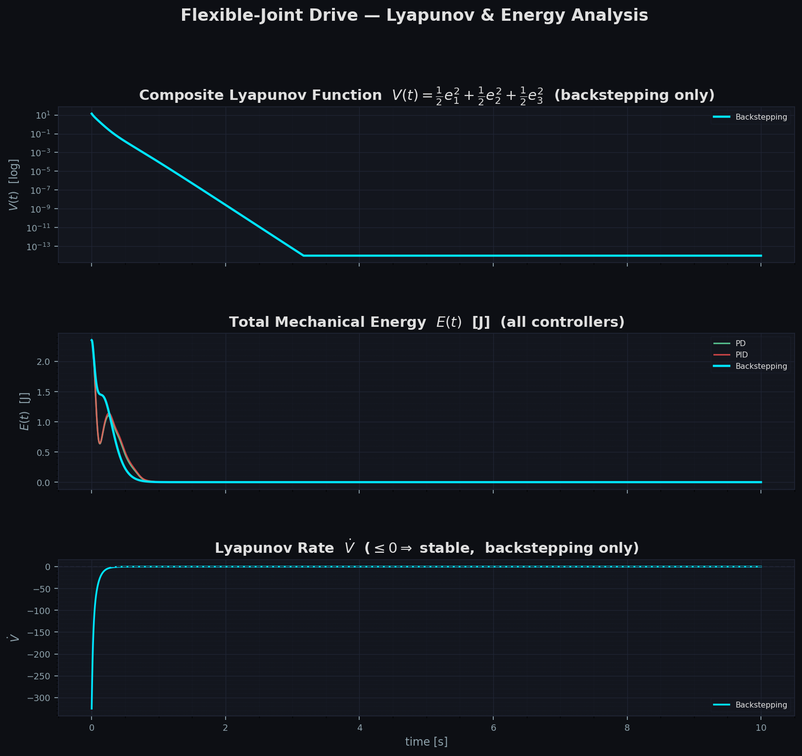

### PD

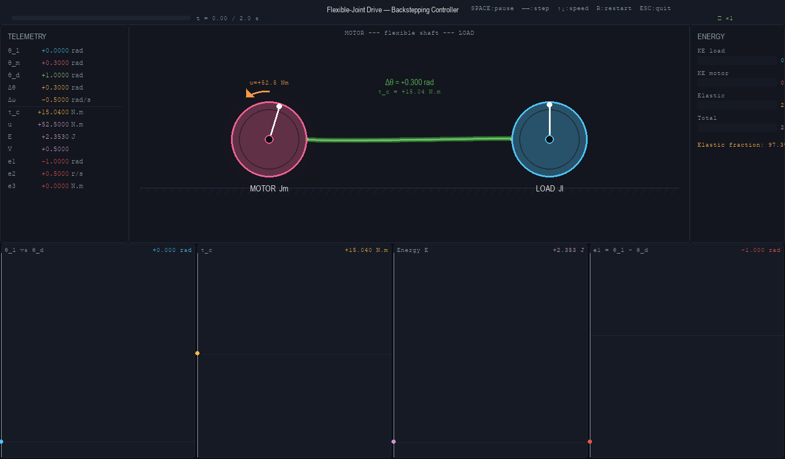

### PID


### Discussion

At first glance, all three controllers appear to reach the vicinity of the desired position. The full simulation plot suggests the primary advantage of backstepping is faster convergence.

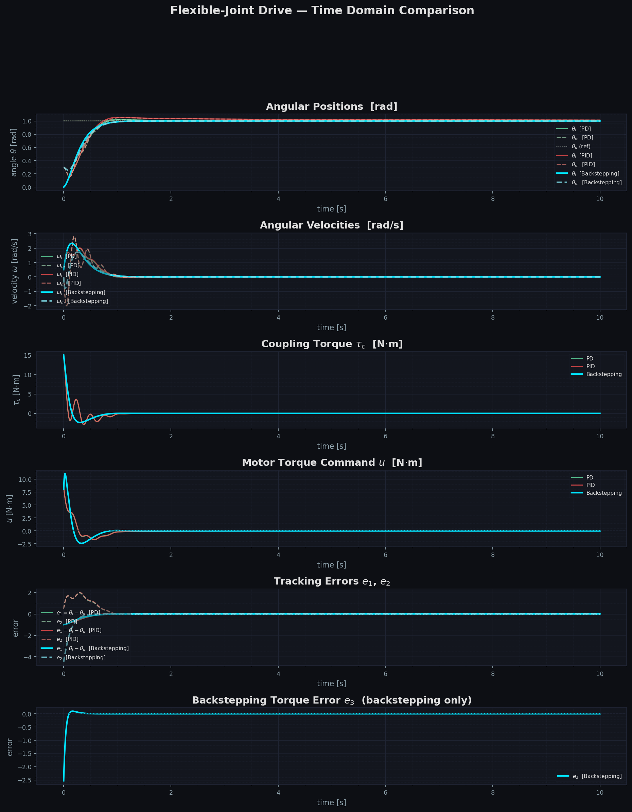

However, the steady-state detail plot — showing only the final second of the simulation — reveals a more subtle but structurally important difference. Both PD and PID converge to a stationary state, but that state is not $\theta_d = 1.0\,\text{rad}$. The PD controller stabilises at a constant positive offset above the setpoint, which is the expected behaviour for a proportional-derivative controller acting on a plant with Coulomb friction and nonlinear stiffness: with no integral action, the proportional term can only balance the steady-state disturbance torque at a nonzero position error. The PID controller, while theoretically capable of eliminating steady-state error through integration, shows a persistent and slowly drifting offset over the simulation horizon, suggesting the integral state has not yet converged — a consequence of the slow time constant introduced by the low integral gain $K_i = 1$ relative to the plant stiffness. In both cases the residual tracking error $e_1 = \theta_l - \theta_d$ remains visibly nonzero at $t = 10\,\text{s}$, while the backstepping controller achieves $e_1 \approx 0$ to numerical precision.

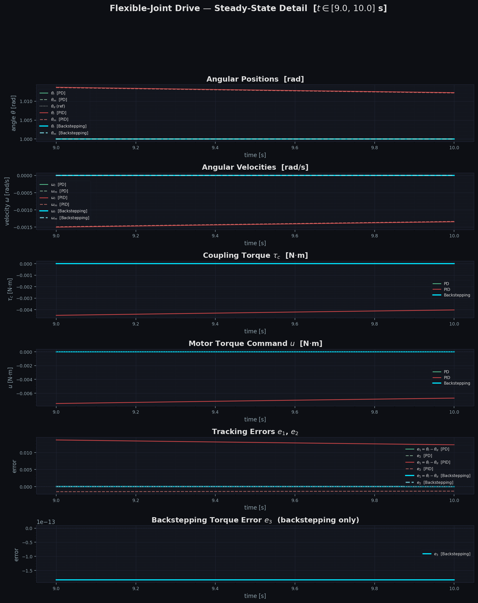

Phase portraits confirm these observations. All three trajectories converge to a fixed point (zero velocity), but the final positions differ: PD and PID land slightly above $\theta_d$, while the backstepping trajectory terminates exactly at the target. The backstepping controller achieves this because it explicitly accounts for the shaft compliance, friction, and load dynamics in the control law — the recursive Lyapunov construction guarantees convergence to the exact equilibrium rather than to a bias point determined by the balance between the proportional gain and the unmodelled internal torques.

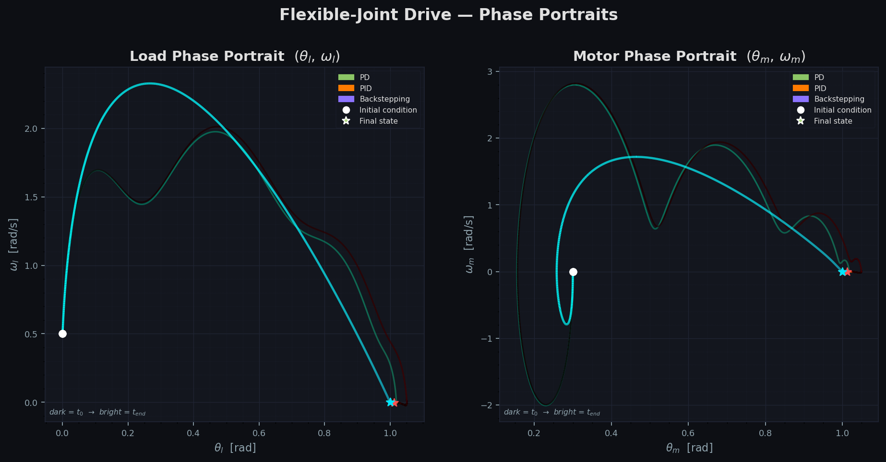

### Trajectory tracking

Beyond equilibrium stabilisation, we tested all three controllers on two time-varying reference signals: a smooth sigmoid step and a sinusoidal trajectory at 0.4 Hz.

The backstepping controller was designed with $\theta_d$ treated as a time-varying function rather than a fixed setpoint. At each step of the recursive construction the virtual controls $\alpha_1$ and $\alpha_2$ are differentiated along the closed-loop trajectories, which requires $\dot\theta_d$, $\ddot\theta_d$, and $\dddot\theta_d$ to be available. This imposes a regularity requirement on the reference: $\theta_d$ must be differentiable up to third order for the feedforward terms in the control law to be well-defined. Both references used here satisfy this condition — the sigmoid is $C^\infty$ by construction, and the sinusoid has derivatives of all orders.

> **Note on Lyapunov analysis for trajectory tracking.**  In our simulations $\mathcal{V}(t)$ is not monotonically decreasing for the sinusoidal case, which we attribute primarily to discretisation error: the RK4 integrator introduces a finite-step approximation of the continuous-time dynamics, and the strict $\dot{\mathcal{V}} \leq 0$ inequality can be violated at individual time steps even when the continuous-time system would satisfy it. Tighter step sizes reduce but do not eliminate this effect.

One further observation: in the trajectory tracking setting backstepping has an informational advantage over PD and PID. The backstepping control law explicitly uses $\dot\theta_d$, $\ddot\theta_d$, and $\dddot\theta_d$ as feedforward terms, giving the controller precise knowledge of how the reference is evolving. PD and PID act only on the current position error and its derivative, with no access to higher-order reference information. This structural difference — not merely gain tuning — is part of why backstepping tracks the sinusoidal reference more accurately.

#### Smooth step

The sigmoid step results closely mirror the equilibrium case. All three controllers converge, but PD settles with a nonzero steady-state offset and PID shows a slow residual drift, while backstepping achieves near-zero tracking error. This is consistent with the equilibrium analysis: the structural limitation of PD and PID — their inability to account for the shaft compliance and friction — manifests as a bias in steady state regardless of whether the reference is constant or transitions smoothly between two constant values.

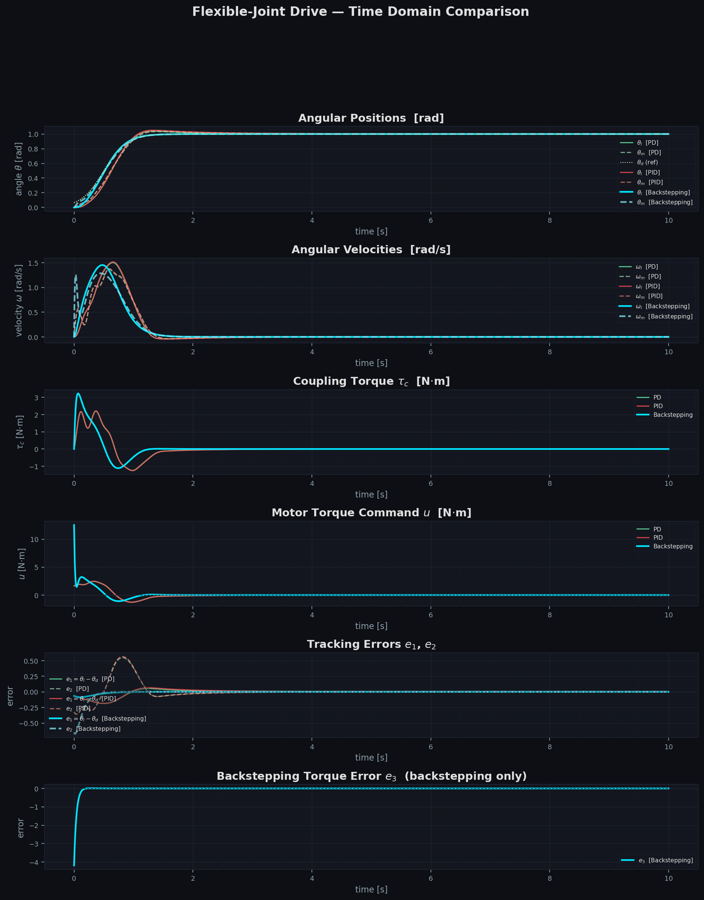


#### Sinusoidal reference

The sinusoidal case reveals a qualitatively different failure mode. At first glance all three controllers appear to follow the reference, but the steady-state detail and phase portraits show that PD and PID converge to a sinusoidal orbit displaced from $\theta_d(t)$, with a persistent amplitude error and phase lag that neither controller can correct without an explicit model of the shaft dynamics and reference derivatives. Backstepping, by contrast, tracks the reference with substantially smaller error throughout.

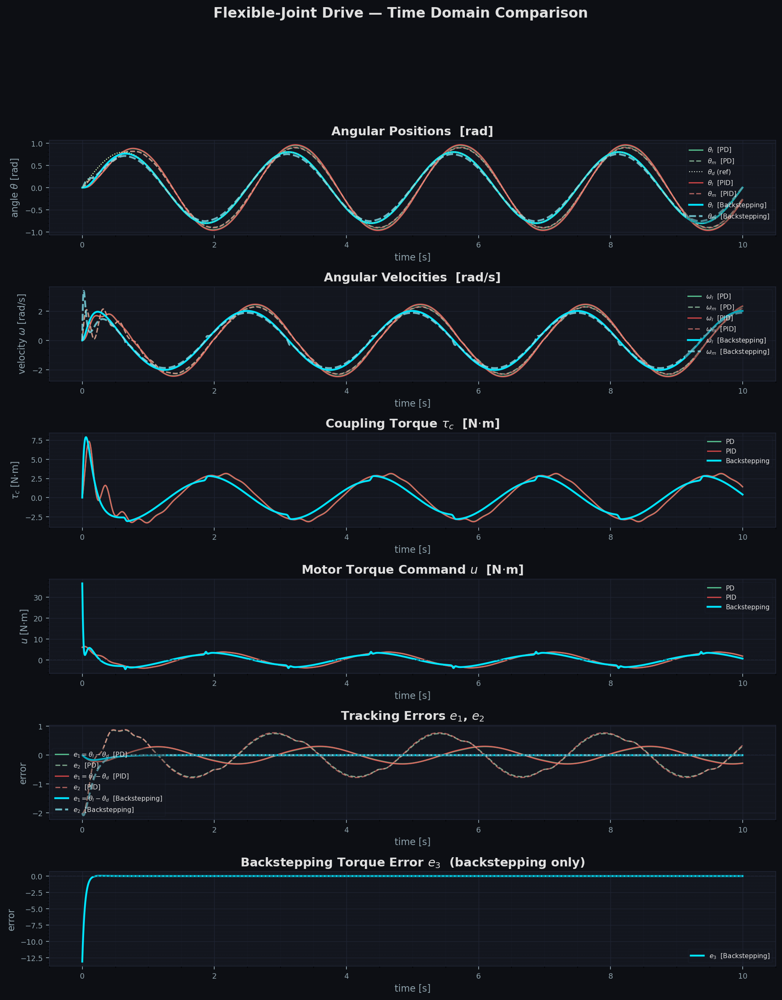
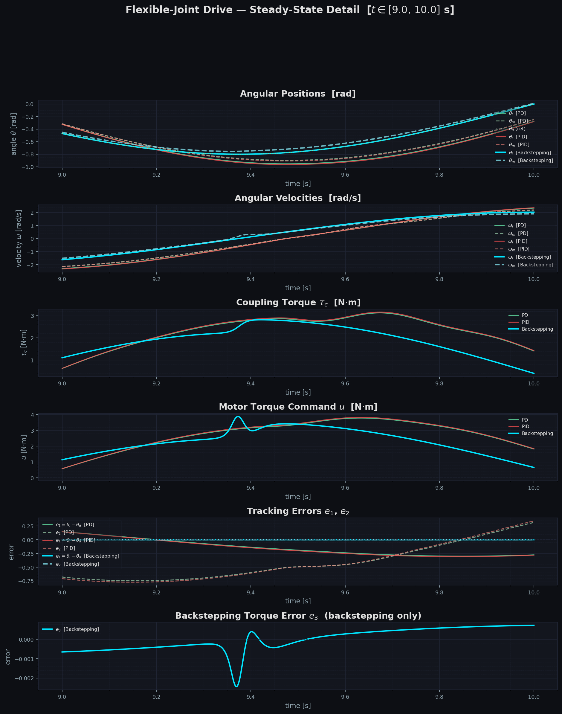

Phase portraits confirm this: the PD and PID trajectories form closed orbits in $(\theta_l, \omega_l)$ space displaced from the backstepping orbit, reflecting the amplitude and phase errors visible in the time-domain plots.

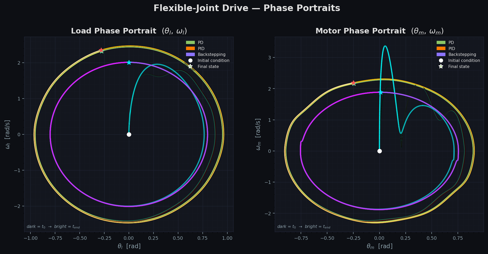

***AI guidance***   
Acknowledgement of AI usage for theoretical information research, structural formatting of the documentation, controller tuning guidance.
